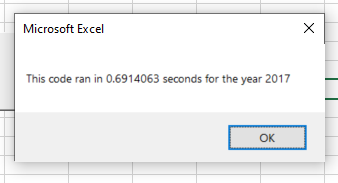
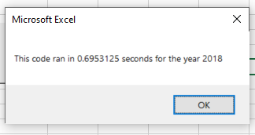

# Refactored Stock Analysis

## Overview of Project
#### This project takes prior code and refactors it to test if there is a difference in the time it takes to run. The 

## Results
#### The initial code was written to count the volume of stock trades for a ticker and also find the beginning price and end price to calculate the annual return. It did this by searching every line of code and repeating this process over and over. The refactored code loops through the data set once and stores all the outputs in an array as opposed to looping multiple times for each ticker symbol.

#### Since we only looped through the entire set once as opposed to each time for each ticker, our code ran faster as shown in the below screenshots.

## Summary
- The advantage of refactored code is that, with improvements, it was faster to write as we did not have to start from scratch and we could use a template we already knew worked. All we had to do was improve on the prior code without breaking it.

- The disadvantage, at least in my experience, was breaking the code often and trying to hunt down the source of problem(s) which kept arising. This happened to me with forgetting to change variable names and assigning variables where they should not have been assigned.   

- While the original code was easier to write and read, it was slower to run.

- With the refactored code, it was faster to run however it doesn't look as "clean" and isn't as easy to follow.

- One of the limitations with both sets that I noticed is that unless the user enters either 2017 or 2018, it breaks the code. In the future, I would like to add something that tells the user the range of inputs they can enter or stops them if they enter something invalid. 
